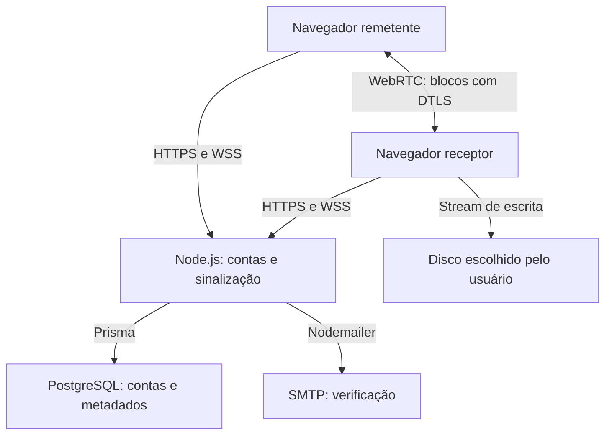
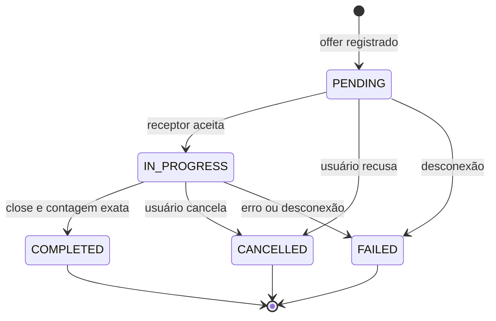

# Arquitetura

TURN, quando configurado e selecionado pelo ICE, retransmite pacotes DTLS criptografados entre os navegadores. Não armazena arquivos; usa banda e está sujeito à sua capacidade operacional. O HTTPS e a integridade do servidor que distribui o JavaScript e os fingerprints SDP fazem parte do modelo de confiança.

## Banco de dados

O esquema completo está em `apps/server/prisma/schema.prisma`. A migração SQL em `migrations/` cria os mesmos modelos, índices, enums e chaves estrangeiras.

| Modelo | Campos principais | Proteção/relacionamento |
| --- | --- | --- |
| `User` | UUID, email único, passwordHash, emailVerifiedAt, createdAt | Senha scrypt com salt único |
| `Session` | UUID, tokenHash, userId, expiresAt | Hash SHA-256; expiração e revogação verificadas em HTTP e WS |
| `VerificationToken` | UUID, tokenHash, userId, expiresAt, createdAt | Token de 256 bits; consumo atômico de uso único |
| `Transfer` | UUID, senderId, receiverId, fileName, fileSize, mimeType, bytesReceived, status, datas | Apenas metadados; tamanho BIGINT serializado como string JSON |

`User` tem várias sessões e tokens. `Transfer` possui duas relações com `User`: remetente e receptor. O mesmo usuário pode ocupar os dois papéis em dispositivos diferentes; a autorização das ações de transferência também é vinculada ao socket, não só ao ID do usuário. Índices compostos atendem o histórico por participante/data.

## Autenticação e verificação

1. O usuário envia e-mail e senha (10–128 caracteres) via HTTPS. E-mail é normalizado para minúsculas.
2. A senha é derivada com scrypt N=32768, r=8, p=3, salt aleatório de 16 bytes e saída de 64 bytes.
3. O backend cria um token de 32 bytes aleatórios, grava apenas seu SHA-256 e envia o valor original por Nodemailer.
4. O link contém o token no fragmento da URL. O frontend remove o fragmento do histórico e só faz POST após clicar em **Confirmar e-mail**, reduzindo consumo por leitores automáticos de links.
5. Uma transação consome o token válido e marca `emailVerifiedAt`. Reutilização/expiração é rejeitada.
6. O login cria um segredo aleatório diferente, guarda seu hash e devolve cookie HttpOnly, SameSite=Lax e Secure em HTTPS. Duração padrão: 7 dias.
7. A API permite consultar a conta ainda não verificada, mas bloqueia ICE, histórico e Socket.io até a ativação. Logout remove a sessão e desconecta seus sockets.

O cadastro repetido responde de forma genérica. Senhas e tokens não são registrados nos logs. Erros de SMTP não ativam a conta. O usuário pode reenviar o link após corrigir a configuração.

## Rotas HTTP

| Método e rota | Acesso | Resultado |
| --- | --- | --- |
| `POST /api/auth/register` | Público, origem válida, rate limit | Cadastro e e-mail de ativação |
| `POST /api/auth/login` | Público, origem válida, rate limit | Sessão HttpOnly |
| `POST /api/auth/verify` | Token, origem válida, rate limit | Ativação da conta |
| `POST /api/auth/resend` | Público, origem válida, rate limit | Novo link, com intervalo mínimo |
| `GET /api/auth/me` | Sessão | Dados públicos da própria conta |
| `POST /api/auth/logout` | Sessão e origem válida | Revogação e remoção do cookie |
| `GET /api/ice` | Sessão e conta verificada | STUN e credenciais TURN temporárias |
| `GET /api/transfers?offset=0` | Sessão e conta verificada | Até 20 transferências próprias |
| `GET /api/transfers/:id` | Participante verificado | Metadados de uma transferência |
| `GET /api/health` | Público | Saúde da API e conexão ao banco |

Requisições de mutação exigem `Origin` exato. O frontend e o backend compartilham a mesma origem por proxy, evitando tokens de sessão em JavaScript e CORS aberto. Chamadas programáticas a POST devem enviar o mesmo `Origin`. API e mensagens de controle têm limite de 70 KB, sem relação com o tamanho dos arquivos que viajam por outro canal.

## Eventos Socket.io

Todos os eventos usam ACK `{ ok: true, data }` ou `{ ok: false, error }`.

| Evento | Quem envia | Dados/efeito |
| --- | --- | --- |
| `room:create` | Receptor | Gera sala e código de 60 bits, válido por 10 minutos |
| `room:join` | Remetente | Reserva a segunda posição pelo código |
| `room:respond` | Receptor dono da sala | Aprova ou recusa a conexão |
| `signal` | Participante de sala aprovada | Offer/answer/candidate encaminhados exclusivamente ao par |
| `room:leave` | Participante | Fecha sala, limpa código e encerra estados ativos |
| `transfer:create` | Socket remetente | Registra os metadados e bloqueia simultaneidade |
| `transfer:start` | Socket receptor | PENDING → IN_PROGRESS, após escolha do disco |
| `transfer:progress` | Socket receptor | Atualiza bytes de forma monotônica, aproximadamente a cada 2 s |
| `transfer:complete` | Socket receptor | Exige IN_PROGRESS e contagem exata; marca COMPLETED |
| `transfer:cancel` | Participante | CANCELLED ou FAILED, somente de estado ativo |

Eventos do servidor incluem `room:request`, `room:ready`, `room:closed` e `signal`. A sala armazena os sockets específicos dos dois lados. O cliente não escolhe livremente um destinatário por ID.

## Estados e falhas

Estados terminais não voltam a ativos. Não é possível marcar sucesso antes de `transfer:start`, com tamanho incompleto ou a partir do socket remetente. O backend não consegue validar fisicamente o arquivo; confia no relato do receptor autenticado.

Se o disco foi fechado com sucesso, mas o registro final no banco falhou, a UI informa **arquivo salvo, histórico não confirmado**. Não declara perda do arquivo já salvo. O usuário deve criar novo pareamento.

## Escala e operação

O MVP usa uma instância de sinalização, com salas e limitadores em memória. Várias instâncias exigiriam Redis/adapter Socket.io, armazenamento/locks para pareamentos, limites distribuídos e detecção de sessões órfãs por instância. Simplesmente colocar um load balancer e subir duas réplicas não é suficiente.

Registros pendentes são marcados FAILED na inicialização. Não rode dois processos da API contra o mesmo banco sem implementar coordenação, pois a recuperação de inicialização pressupõe posse exclusiva.

Tokens/sessões expirados são removidos periodicamente. Defina retenção de histórico, backups e política de privacidade antes de abrir o serviço a terceiros. O banco contém e-mails e nomes de arquivos, embora não contenha o conteúdo transferido.
